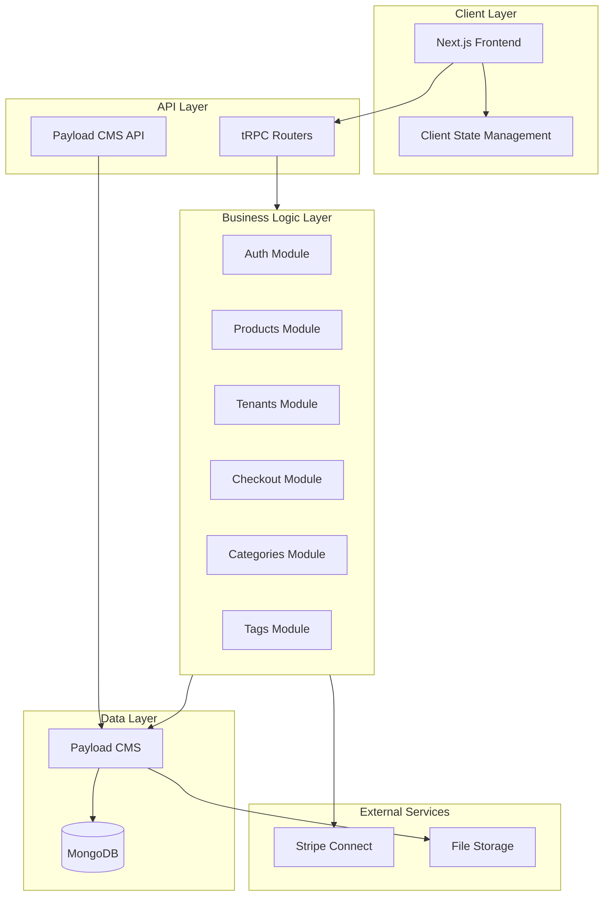
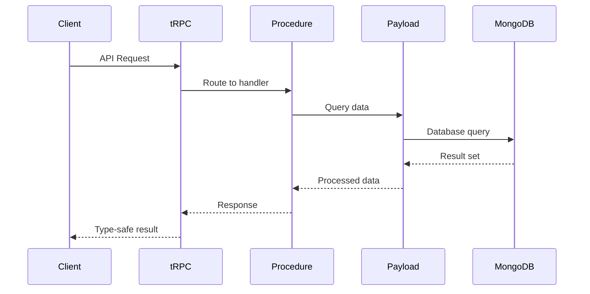
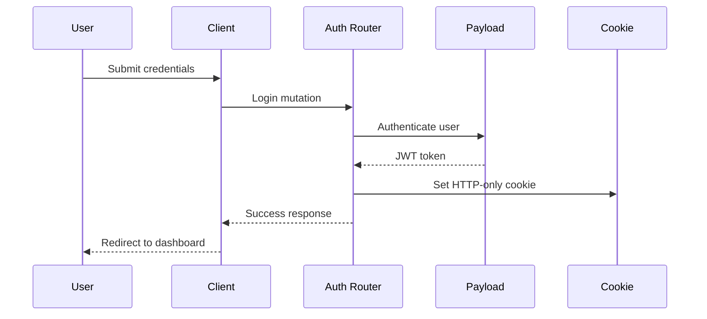

## Architecture Overview

The marketplace platform is built using a modern full-stack architecture combining Next.js, Payload CMS, tRPC, and MongoDB. This architecture enables a scalable multi-tenant SaaS platform where vendors can create and manage their own storefronts.

## High-Level Architecture



## Technology Stack

### Frontend
- **Next.js 15**: React framework with App Router for server-side rendering and routing
- **TypeScript**: Type-safe development across the entire stack
- **React**: UI component library
- **Client State**: Custom hooks and stores for managing cart and UI state

### Backend
- **Payload CMS**: Headless CMS providing admin UI and database abstraction
- **tRPC**: End-to-end type-safe API layer
- **Node.js**: Runtime environment

### Database
- **MongoDB**: Document database via Mongoose adapter
- **Mongoose**: ODM for schema validation and queries

### Infrastructure
- **Multi-Tenant Plugin**: `@payloadcms/plugin-multi-tenant` for tenant isolation
- **Stripe Connect**: Payment processing and vendor payouts
- **Sharp**: Image processing and optimization

## Core Components

### 1. Payload CMS Configuration

Central configuration defining collections, plugins, and database:

```typescript src/payload.config.ts
export default buildConfig({
  admin: {
    user: Users.slug,
  },
  collections: [Users, Media, Categories, Products, Tags, Tenants],
  editor: lexicalEditor(),
  db: mongooseAdapter({
    url: process.env.DATABASE_URI || "",
  }),
  plugins: [
    payloadCloudPlugin(),
    multiTenantPlugin<Config>({
      collections: { products: {} },
      userHasAccessToAllTenants: (user) =>
        Boolean(user?.roles?.includes("super-admin")),
    }),
  ],
});
```

### 2. tRPC API Layer

Type-safe API routers organized by domain:

```typescript src/trpc/routers/_app.ts
export const appRouter = createTRPCRouter({
  auth: authRouter,
  tags: tagsRouter,
  tenants: tenantsRouter,
  checkout: checkoutRouter,
  products: productsRouter,
  categories: categoriesRouter,
});
```

<Info>
tRPC provides full type safety from the database to the frontend, eliminating the need for manual API type definitions.
</Info>

### 3. Module-Based Organization

The codebase is organized into feature modules:

```
src/modules/
├── auth/              # Authentication and authorization
├── products/          # Product management
├── tenants/           # Tenant/vendor management
├── checkout/          # Shopping cart and checkout
├── categories/        # Product categorization
└── tags/              # Product tagging
```

Each module contains:
- **server/procedures.ts**: tRPC router and server-side logic
- **schemas.ts**: Zod validation schemas
- **hooks/**: React hooks for client-side data fetching
- **ui/**: UI components specific to the module

## Data Flow

### Request Flow



### Authentication Flow



## Collections Schema

### Core Collections

<Tabs>
  <Tab title="Users">
    ```typescript
    {
      email: string
      username: string
      password: string (hashed)
      roles: ["super-admin" | "user"]
      tenants: [{ tenant: TenantID }]
    }
    ```
  </Tab>
  
  <Tab title="Tenants">
    ```typescript
    {
      name: string
      slug: string (unique, indexed)
      image: MediaID
      stripeAccountId: string
      stripeDetailsSubmitted: boolean
    }
    ```
  </Tab>
  
  <Tab title="Products">
    ```typescript
    {
      name: string
      description: string
      price: number
      category: CategoryID
      tags: TagID[]
      image: MediaID
      refundPolicy: string
      tenant: TenantID (auto-added by plugin)
    }
    ```
  </Tab>
  
  <Tab title="Categories">
    ```typescript
    {
      name: string
      slug: string (unique, indexed)
      color: string
      parent: CategoryID | null
      subcategories: CategoryID[] (join)
    }
    ```
  </Tab>
</Tabs>

## Context Injection

The tRPC context provides access to Payload CMS:

```typescript src/trpc/init.ts
export const baseProcedure = t.procedure.use(async ({ next }) => {
  const payload = await getPayload({ config });
  
  return next({ ctx: { db: payload } });
});
```

This makes the Payload instance available in all procedures:

```typescript
baseProcedure.query(async ({ ctx }) => {
  const products = await ctx.db.find({
    collection: "products",
  });
  return products;
});
```

## Multi-Tenant Data Scoping

The multi-tenant plugin automatically adds tenant filtering:

<CodeGroup>
```typescript User Query
// User with tenants: ["tenant-1", "tenant-2"]
const products = await payload.find({
  collection: "products",
});
// Automatically filters to products from tenant-1 and tenant-2
```

```typescript Super Admin Query
// Super admin user
const products = await payload.find({
  collection: "products",
});
// Returns products from ALL tenants
```
</CodeGroup>

## API Routes

### Payload CMS Routes
- `/api/[...slug]` - Payload CMS REST API
- `/api/graphql` - GraphQL API endpoint
- `/admin` - Payload admin panel

### tRPC Routes
- `/api/trpc/[trpc]` - All tRPC procedures
  - `auth.login`
  - `auth.register`
  - `auth.session`
  - `products.*`
  - `tenants.*`
  - `checkout.*`
  - etc.

## Security Considerations

<Warning>
Always validate user input with Zod schemas before processing in tRPC procedures.
</Warning>

1. **Authentication**: JWT-based with HTTP-only cookies
2. **Authorization**: Role-based access control (RBAC)
3. **Tenant Isolation**: Automatic data scoping via multi-tenant plugin
4. **Input Validation**: Zod schemas on all API inputs
5. **Password Security**: Automatic hashing via Payload auth

## Performance Optimizations

- **Database Indexing**: Unique slugs and IDs are indexed
- **Image Optimization**: Sharp for automatic image processing
- **Server Components**: Next.js App Router for server-side rendering
- **Type Safety**: Compile-time type checking eliminates runtime errors
- **Superjson**: Efficient data serialization for tRPC

## Scalability

The architecture supports horizontal scaling:

- **Stateless API**: Can run multiple instances behind a load balancer
- **Database**: MongoDB supports sharding for large datasets
- **File Storage**: Pluggable storage adapters (S3, etc.)
- **Multi-Tenancy**: Add unlimited vendors without infrastructure changes

## Related Resources

- [Multi-Tenancy](/concepts/multi-tenancy)
- [Authentication System](/concepts/authentication)
- [Payment Integration](/concepts/payments)