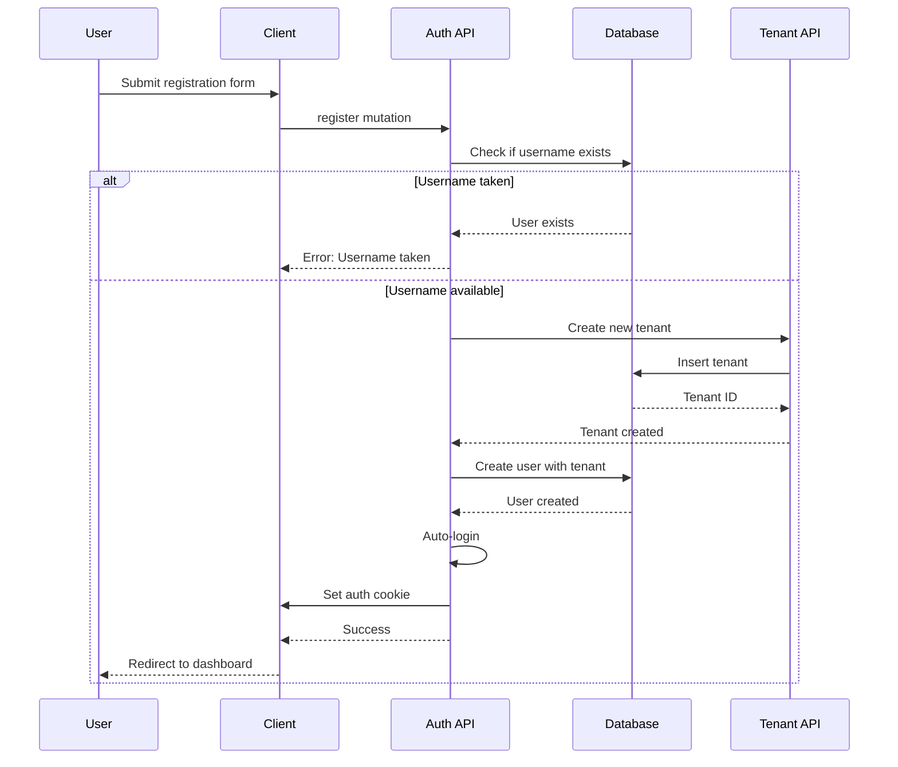

## Overview

The marketplace platform uses Payload CMS's built-in authentication system combined with custom role-based access control (RBAC). This provides secure user authentication, session management, and granular permissions based on user roles and tenant associations.

## Authentication System

### Built on Payload Auth

The Users collection is configured with authentication enabled:

```typescript src/collections/Users.ts
export const Users: CollectionConfig = {
  slug: "users",
  admin: {
    useAsTitle: "email",
  },
  auth: true,  // Enables authentication
  fields: [
    // ... fields
  ],
};
```

This provides:
- Password hashing (bcrypt)
- JWT token generation
- Session management
- Password reset functionality
- Email verification (optional)

## User Schema

Each user has the following structure:

```typescript src/collections/Users.ts
{
  email: string (unique, required)
  username: string (unique, required)
  password: string (hashed automatically)
  roles: ["super-admin" | "user"] (multi-select)
  tenants: [
    {
      tenant: TenantID
    }
  ]
}
```

### Field Details

| Field | Type | Description |
|-------|------|-------------|
| `email` | Email | User's email address for login and notifications |
| `username` | Text | Unique username, also used as initial tenant slug |
| `password` | Password | Hashed password (never stored in plain text) |
| `roles` | Select | User roles determining system-wide permissions |
| `tenants` | Array | List of tenants the user has access to |

## User Roles

### Available Roles

<Tabs>
  <Tab title="Super Admin">
    **Capabilities:**
    - Access all tenants and their data
    - Manage platform-wide settings
    - View and modify any products, categories, tags
    - Create and manage other users
    - Access admin dashboard for all vendors
    
    **Use Cases:**
    - Platform administrators
    - Customer support staff
    - System maintenance
  </Tab>
  
  <Tab title="User (Default)">
    **Capabilities:**
    - Access only assigned tenants
    - Manage products for their tenant(s)
    - View their own sales and analytics
    - Update their tenant profile
    
    **Use Cases:**
    - Vendor/merchant accounts
    - Store managers
    - Individual sellers
  </Tab>
</Tabs>

### Role Configuration

```typescript src/collections/Users.ts
{
  name: "roles",
  type: "select",
  defaultValue: ["user"],  // New users default to "user" role
  hasMany: true,           // Users can have multiple roles
  options: ["super-admin", "user"],
}
```

<Warning>
Be cautious when assigning the `super-admin` role, as it grants unrestricted access to all platform data.
</Warning>

## Authentication Flow

### Registration Process



### Registration Implementation

```typescript src/modules/auth/server/procedures.ts
register: baseProcedure
  .input(registerSchema)
  .mutation(async ({ input, ctx }) => {
    // Check for existing username
    const existingData = await ctx.db.find({
      collection: "users",
      where: { username: { equals: input.username } },
    });

    if (existingData.docs[0]) {
      throw new TRPCError({
        code: "BAD_REQUEST",
        message: "Username already taken",
      });
    }

    // Create tenant for the user
    const tenant = await ctx.db.create({
      collection: "tenants",
      data: {
        name: input.username,
        slug: input.username,
        stripeAccountId: "test",
      },
    });

    // Create user with tenant association
    await ctx.db.create({
      collection: "users",
      data: {
        email: input.email,
        username: input.username,
        password: input.password, // Auto-hashed by Payload
        tenants: [{ tenant: tenant.id }],
      },
    });

    // Auto-login after registration
    const data = await ctx.db.login({
      collection: "users",
      data: { email: input.email, password: input.password },
    });

    // Set authentication cookie
    await generateAuthCookie({
      prefix: ctx.db.config.cookiePrefix,
      value: data.token,
    });
  }),
```

<Note>
Every new user automatically gets their own tenant created during registration, making them an instant vendor on the platform.
</Note>

### Login Process

```typescript src/modules/auth/server/procedures.ts
login: baseProcedure
  .input(loginSchema)
  .mutation(async ({ input, ctx }) => {
    const data = await ctx.db.login({
      collection: "users",
      data: {
        email: input.email,
        password: input.password,
      },
    });

    if (!data.token) {
      throw new TRPCError({
        code: "UNAUTHORIZED",
        message: "Failed to login",
      });
    }

    await generateAuthCookie({
      prefix: ctx.db.config.cookiePrefix,
      value: data.token,
    });

    return data;
  }),
```

## Input Validation

### Login Schema

```typescript src/modules/auth/schemas.ts
export const loginSchema = z.object({
  email: z.email(),
  password: z.string(),
});
```

### Registration Schema

```typescript src/modules/auth/schemas.ts
export const registerSchema = z.object({
  email: z.email(),
  password: z
    .string()
    .min(8, { message: "Password must be at least 8 characters long" })
    .max(32, { message: "Password must not exceed 32 characters" })
    .regex(/[a-z]/, { message: "Password must contain at least one lowercase letter" })
    .regex(/[A-Z]/, { message: "Password must contain at least one uppercase letter" })
    .regex(/\d/, { message: "Password must contain at least one number" })
    .regex(/[^a-zA-Z0-9]/, { message: "Password must contain at least one special character" }),
  username: z
    .string()
    .min(3, "Username must be at least 3 characters")
    .max(63, "Username must be less than 63 characters")
    .regex(
      /^[a-z0-9][a-z0-9-]*[a-z0-9]$/,
      "Username can only contain lowercase letters, numbers and hyphens. It must start and end with a letter or number"
    )
    .refine(
      (val) => !val.includes("--"),
      "Username cannot contain consecutive hyphens"
    )
    .transform((val) => val.toLowerCase()),
});
```

<Info>
The username validation ensures it's suitable for use as a subdomain slug (e.g., `username.market.com`).
</Info>

## Session Management

### Cookie-Based Sessions

Authentication uses HTTP-only cookies for security:

```typescript src/modules/auth/utils.ts
export const generateAuthCookie = async ({ prefix, value }: Props) => {
  const cookies = await getCookies();
  cookies.set({
    name: `${prefix}-token`,
    value: value,
    httpOnly: true,  // Prevents XSS attacks
    path: "/",
    // TODO: Configure for production:
    // sameSite: "none",
    // domain: ".market.com"
  });
};
```

<Warning>
For production deployment with subdomains, configure `sameSite` and `domain` settings to enable cross-subdomain authentication.
</Warning>

### Getting Current Session

```typescript src/modules/auth/server/procedures.ts
session: baseProcedure.query(async ({ ctx }) => {
  const headers = await getHeaders();
  const session = await ctx.db.auth({ headers });
  return session;
}),
```

## Authorization Patterns

### Super Admin Check

```typescript src/payload.config.ts
userHasAccessToAllTenants: (user) =>
  Boolean(user?.roles?.includes("super-admin"))
```

This function is used by the multi-tenant plugin to determine if a user should bypass tenant filtering.

### Tenant Access Control

The `tenantsArrayField` configuration controls who can read and modify tenant associations:

```typescript src/collections/Users.ts
const defaultTenantArrayField = tenantsArrayField({
  tenantsArrayFieldName: "tenants",
  tenantsCollectionSlug: "tenants",
  arrayFieldAccess: {
    read: () => true,
    create: () => true,
    update: () => true,
  },
  tenantFieldAccess: {
    read: () => true,
    create: () => true,
    update: () => true,
  },
});
```

<Note>
These access control functions can be customized to implement more granular permissions based on user roles or other criteria.
</Note>

## Security Best Practices

<CardGroup cols={2}>
  <Card title="Password Security" icon="lock">
    - Minimum 8 characters
    - Requires uppercase, lowercase, number, special char
    - Automatically hashed with bcrypt
    - Never logged or displayed
  </Card>
  
  <Card title="Session Security" icon="shield">
    - HTTP-only cookies prevent XSS
    - JWT tokens for stateless auth
    - Automatic token expiration
    - Secure cookie flags in production
  </Card>
  
  <Card title="Input Validation" icon="check">
    - Zod schemas validate all inputs
    - SQL injection prevention via Mongoose
    - Username format enforced
    - Email validation
  </Card>
  
  <Card title="Access Control" icon="user-shield">
    - Role-based permissions
    - Tenant-based data isolation
    - Super admin override capability
    - Field-level access control
  </Card>
</CardGroup>

## Testing Authentication

### Creating Test Users

```typescript
// Regular vendor user
await payload.create({
  collection: "users",
  data: {
    email: "vendor@example.com",
    username: "testvendor",
    password: "SecurePass123!",
    roles: ["user"],
    tenants: [{ tenant: tenantId }],
  },
});

// Super admin user
await payload.create({
  collection: "users",
  data: {
    email: "admin@example.com",
    username: "admin",
    password: "AdminPass123!",
    roles: ["super-admin"],
  },
});
```

## Related Resources

- [Multi-Tenancy](/concepts/multi-tenancy)
- [System Architecture](/concepts/architecture)
- [Vendor Dashboard](/guides/vendor-dashboard)