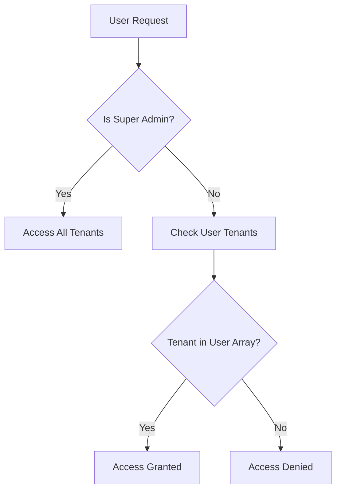

## Overview

The marketplace platform uses a multi-tenant architecture powered by the `@payloadcms/plugin-multi-tenant` plugin. This enables multiple independent vendors (tenants) to operate their own storefronts within a single application instance, while maintaining data isolation and proper access controls.

## How It Works

### Multi-Tenant Plugin Configuration

The multi-tenant plugin is configured in the Payload CMS configuration:

```typescript src/payload.config.ts
multiTenantPlugin<Config>({
  collections: {
    products: {},
  },
  tenantsArrayField: {
    includeDefaultField: false,
  },
  userHasAccessToAllTenants: (user) =>
    Boolean(user?.roles?.includes("super-admin")),
})
```

**Key configuration details:**
- **Collections**: Specifies which collections are tenant-scoped (in this case, `products`)
- **Tenants Array Field**: Controls how tenants are associated with records
- **Access Control**: Super-admins can access all tenants, while regular users are restricted to their assigned tenants

### Tenant Isolation

<Info>
Each tenant operates independently with their own products, branding, and Stripe account, while sharing the same database and application infrastructure.
</Info>

Tenant isolation is achieved through:

1. **Data Scoping**: Products and other tenant-specific data are automatically filtered based on the current user's tenant association
2. **Access Control**: Users can only view and modify data for tenants they're associated with
3. **Super Admin Override**: Users with the `super-admin` role can access all tenants

## Tenant Structure

Each tenant represents a vendor's storefront and contains:

```typescript src/collections/Tenants.ts
{
  name: "Store Name",           // Display name of the store
  slug: "store-slug",            // Unique subdomain identifier
  image: "media-id",             // Store logo/branding
  stripeAccountId: "acct_xxx",   // Stripe Connect account ID
  stripeDetailsSubmitted: true   // Whether Stripe onboarding is complete
}
```

### Tenant Fields

| Field | Type | Description |
|-------|------|-------------|
| `name` | Text | Human-readable store name (e.g., "Pinnacle's Store") |
| `slug` | Text | URL-friendly identifier used for subdomains (e.g., `[slug].market.com`) |
| `image` | Upload | Store logo or branding image |
| `stripeAccountId` | Text | Connected Stripe account ID (read-only) |
| `stripeDetailsSubmitted` | Checkbox | Indicates if vendor completed Stripe onboarding |

<Warning>
Vendors cannot create products until `stripeDetailsSubmitted` is `true`. This ensures all vendors have completed payment onboarding before selling.
</Warning>

## User-Tenant Association

Users are associated with tenants through a relationship array:

```typescript src/collections/Users.ts
tenants: [
  {
    tenant: "tenant-id-1",
  },
  {
    tenant: "tenant-id-2",
  }
]
```

### Multi-Tenant Users

A single user can be associated with multiple tenants, enabling scenarios like:
- Marketplace administrators managing multiple vendor accounts
- Consultants working with several stores
- Users who both buy and sell on the platform

## Access Control Flow



## Tenant Creation on Registration

When a new user registers, a tenant is automatically created for them:

```typescript src/modules/auth/server/procedures.ts
const tenant = await ctx.db.create({
  collection: "tenants",
  data: {
    name: input.username,
    slug: input.username,
    stripeAccountId: "test",
  },
});

await ctx.db.create({
  collection: "users",
  data: {
    email: input.email,
    username: input.username,
    password: input.password,
    tenants: [
      {
        tenant: tenant.id,
      },
    ],
  },
});
```

<Note>
This automatic tenant creation ensures every vendor gets their own storefront immediately upon registration.
</Note>

## Querying Tenant-Scoped Data

When fetching products or other tenant-scoped data, the multi-tenant plugin automatically filters results:

```typescript
// Automatically filters to current user's tenants
const products = await payload.find({
  collection: "products",
});

// Super admins see all products
// Regular users only see products from their tenants
```

## Benefits of Multi-Tenancy

<CardGroup cols={2}>
  <Card title="Resource Efficiency" icon="server">
    Single application instance serves multiple vendors, reducing infrastructure costs
  </Card>
  <Card title="Data Isolation" icon="shield">
    Vendors can only access their own data, ensuring privacy and security
  </Card>
  <Card title="Simplified Management" icon="sliders">
    Centralized platform updates benefit all tenants simultaneously
  </Card>
  <Card title="Scalability" icon="chart-line">
    Add new vendors without deploying new infrastructure
  </Card>
</CardGroup>

## Best Practices

1. **Unique Slugs**: Ensure tenant slugs are unique and URL-friendly for subdomain routing
2. **Access Testing**: Always test data access with non-admin users to verify isolation
3. **Tenant Context**: Pass tenant context explicitly in API calls when needed
4. **Stripe Verification**: Check `stripeDetailsSubmitted` before allowing product creation

## Related Resources

- [Authentication System](/concepts/authentication)
- [Payment Integration](/concepts/payments)
- [Architecture Overview](/concepts/architecture)