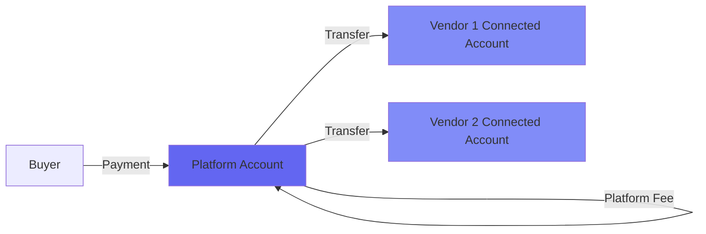
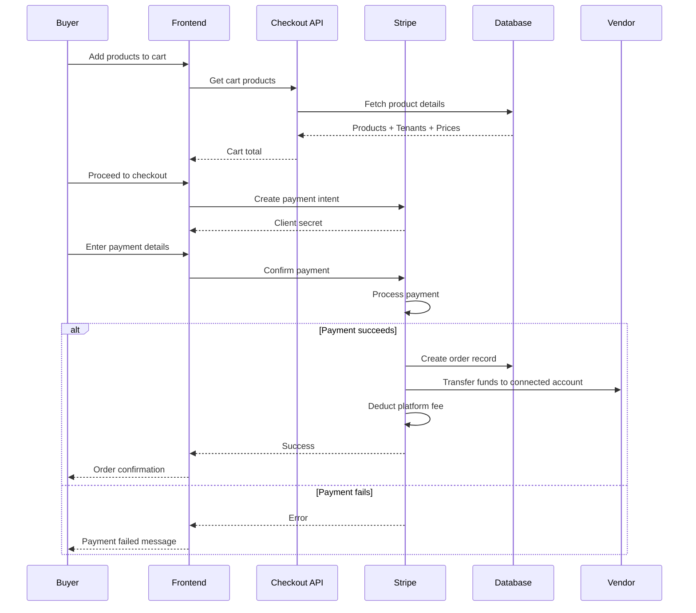

## Overview

The marketplace platform uses **Stripe Connect** to handle payments in a multi-vendor environment. This enables the platform to collect payments from buyers and automatically distribute funds to individual vendors, while optionally taking platform fees.

## Stripe Connect Architecture



### How It Works

1. **Vendor Onboarding**: Each vendor connects their Stripe account via Stripe Connect
2. **Payment Processing**: Buyers pay the platform (master Stripe account)
3. **Fund Distribution**: Platform automatically transfers funds to vendor accounts
4. **Fee Collection**: Platform can deduct fees before transferring to vendors

<Info>
Stripe Connect allows vendors to receive payments directly into their own bank accounts while the platform manages the checkout experience.
</Info>

## Tenant Stripe Integration

Each tenant (vendor) has Stripe account information stored:

```typescript src/collections/Tenants.ts
{
  name: "stripeAccountId",
  type: "text",
  required: true,
  admin: {
    readOnly: true,  // Populated programmatically
  },
},
{
  name: "stripeDetailsSubmitted",
  type: "checkbox",
  admin: {
    readOnly: true,
    description: "You cannot create products until you submit your Stripe details",
  },
}
```

### Stripe Account Fields

| Field | Type | Description |
|-------|------|-------------|
| `stripeAccountId` | Text | Connected Stripe account ID (e.g., `acct_1234567890`) |
| `stripeDetailsSubmitted` | Boolean | Whether vendor completed Stripe onboarding |

<Warning>
Vendors cannot create products until `stripeDetailsSubmitted` is `true`. This ensures all vendors can receive payments before listing products.
</Warning>

## Payment Flow

### Complete Checkout Process



## Checkout Implementation

### Getting Cart Products

The checkout router fetches products with tenant and pricing information:

```typescript src/modules/checkout/server/procedures.ts
export const checkoutRouter = createTRPCRouter({
  getProducts: baseProcedure
    .input(
      z.object({
        ids: z.array(z.string()),
      })
    )
    .query(async ({ ctx, input }) => {
      const data = await ctx.db.find({
        collection: "products",
        depth: 2, // Populate "category", "image" and "tenant & tenant.image"
        where: {
          id: {
            in: input.ids,
          },
        },
      });

      if (data.totalDocs !== input.ids.length) {
        throw new TRPCError({
          code: "NOT_FOUND",
          message: "Products not found",
        });
      }

      const totalPrice = data.docs.reduce((acc, product) => {
        const price = Number(product.price);
        return acc + (isNaN(price) ? 0 : price);
      }, 0);

      return {
        ...data,
        totalPrice: totalPrice,
        docs: data.docs.map((doc) => ({
          ...doc,
          image: doc.image as Media | null,
          tenant: doc.tenant as Tenant & { image: Media | null },
        })),
      };
    }),
});
```

### Key Features

- **Depth 2 Population**: Loads product, category, image, tenant, and tenant image in one query
- **Validation**: Ensures all requested products exist
- **Price Calculation**: Automatically sums product prices for cart total
- **Type Safety**: Returns properly typed entities with relationships

<Note>
The `depth: 2` parameter ensures all nested relationships are populated, so you get complete tenant and product information for payment processing.
</Note>

## Product Pricing

### Price Configuration

```typescript src/collections/Products.ts
{
  name: "price",
  type: "number",
  required: true,
  admin: {
    description: "in INR",  // Currency can be configured
  },
}
```

<Info>
Prices are stored in the smallest currency unit (e.g., paise for INR, cents for USD). Make sure to convert when displaying to users.
</Info>

## Stripe Connect Account Types

The platform can use different Stripe Connect account types:

<Tabs>
  <Tab title="Standard Accounts">
    **Best for:** Full-service marketplaces
    
    **Characteristics:**
    - Vendors have full Stripe dashboard access
    - Vendors handle their own disputes and chargebacks
    - Platform has limited liability
    - Recommended for most marketplaces
    
    **Setup:**
    ```typescript
    const accountLink = await stripe.accountLinks.create({
      account: 'acct_1234567890',
      refresh_url: 'https://market.com/reauth',
      return_url: 'https://market.com/dashboard',
      type: 'account_onboarding',
    });
    ```
  </Tab>
  
  <Tab title="Express Accounts">
    **Best for:** Simple onboarding
    
    **Characteristics:**
    - Faster onboarding process
    - Limited Stripe dashboard for vendors
    - Platform handles some compliance
    - Good for smaller vendors
    
    **Setup:**
    ```typescript
    const account = await stripe.accounts.create({
      type: 'express',
      country: 'US',
      email: vendor.email,
      capabilities: {
        card_payments: {requested: true},
        transfers: {requested: true},
      },
    });
    ```
  </Tab>
  
  <Tab title="Custom Accounts">
    **Best for:** Full platform control
    
    **Characteristics:**
    - Platform fully responsible for compliance
    - Vendors don't see Stripe branding
    - Most customizable experience
    - Higher compliance requirements
    
    **Setup:**
    ```typescript
    const account = await stripe.accounts.create({
      type: 'custom',
      country: 'US',
      email: vendor.email,
      capabilities: {
        card_payments: {requested: true},
        transfers: {requested: true},
      },
    });
    ```
  </Tab>
</Tabs>

## Platform Fees

Stripe Connect supports multiple fee models:

### Application Fee

Charge a percentage or fixed fee on each transaction:

```typescript
const paymentIntent = await stripe.paymentIntents.create({
  amount: 2000,  // $20.00
  currency: 'usd',
  application_fee_amount: 200,  // $2.00 platform fee (10%)
  transfer_data: {
    destination: vendorStripeAccountId,
  },
});
```

### Destination Charges

Automatic transfer with platform fee:

```typescript
const charge = await stripe.charges.create({
  amount: 2000,
  currency: 'usd',
  source: 'tok_visa',
  destination: {
    account: vendorStripeAccountId,
    amount: 1800,  // Vendor receives $18, platform keeps $2
  },
});
```

### Separate Charges and Transfers

Charge customer, then transfer to vendor:

```typescript
// Charge the customer
const charge = await stripe.charges.create({
  amount: 2000,
  currency: 'usd',
  source: 'tok_visa',
});

// Transfer to vendor later
const transfer = await stripe.transfers.create({
  amount: 1800,  // After 10% platform fee
  currency: 'usd',
  destination: vendorStripeAccountId,
});
```

## Refund Policies

Each product can specify its refund policy:

```typescript src/collections/Products.ts
{
  name: "refundPolicy",
  type: "select",
  options: ["30-day", "14-day", "7-day", "3-day", "1-day", "no-refunds"],
  defaultValue: "30-day",
}
```

### Handling Refunds

```typescript
// Full refund
const refund = await stripe.refunds.create({
  charge: chargeId,
  refund_application_fee: true,  // Also refund platform fee
});

// Partial refund
const partialRefund = await stripe.refunds.create({
  charge: chargeId,
  amount: 500,  // Refund $5 of $20 charge
});
```

<Warning>
When refunding, decide whether to refund the platform fee (`refund_application_fee: true`) or keep it.
</Warning>

## Multi-Vendor Cart Handling

Carts can contain products from multiple vendors:

```typescript
// Cart with products from different vendors
const cart = [
  { productId: "prod_1", tenantId: "tenant_a" },
  { productId: "prod_2", tenantId: "tenant_a" },
  { productId: "prod_3", tenantId: "tenant_b" },
];

// Group by vendor for separate payments
const ordersByVendor = groupBy(cart, 'tenantId');

// Create separate payment intents for each vendor
for (const [tenantId, products] of Object.entries(ordersByVendor)) {
  const tenant = await getTenant(tenantId);
  const total = products.reduce((sum, p) => sum + p.price, 0);
  
  await stripe.paymentIntents.create({
    amount: total,
    currency: 'inr',
    application_fee_amount: Math.floor(total * 0.1),  // 10% fee
    transfer_data: {
      destination: tenant.stripeAccountId,
    },
  });
}
```

## Webhook Integration

Handle Stripe events to update order status:

```typescript
// Listen for payment success
stripe.webhooks.constructEvent(
  req.body,
  signature,
  webhookSecret
);

switch (event.type) {
  case 'payment_intent.succeeded':
    // Update order status to "paid"
    await payload.update({
      collection: 'orders',
      id: orderId,
      data: { status: 'paid' },
    });
    break;
    
  case 'account.updated':
    // Update tenant's stripeDetailsSubmitted
    const account = event.data.object;
    if (account.details_submitted) {
      await payload.update({
        collection: 'tenants',
        where: { stripeAccountId: { equals: account.id } },
        data: { stripeDetailsSubmitted: true },
      });
    }
    break;
}
```

## Testing Payments

### Test Mode

Use Stripe test mode credentials:

```bash
STRIPE_SECRET_KEY=sk_test_...
STRIPE_PUBLISHABLE_KEY=pk_test_...
```

### Test Cards

| Card Number | Scenario |
|-------------|----------|
| 4242 4242 4242 4242 | Successful payment |
| 4000 0000 0000 0002 | Card declined |
| 4000 0000 0000 9995 | Insufficient funds |
| 4000 0025 0000 3155 | Requires authentication (3D Secure) |

<Info>
Use any future expiry date and any 3-digit CVC for test cards.
</Info>

## Security Best Practices

<CardGroup cols={2}>
  <Card title="API Keys" icon="key">
    - Never expose secret keys in frontend code
    - Store keys in environment variables
    - Use test keys for development
    - Rotate keys periodically
  </Card>
  
  <Card title="Webhook Verification" icon="shield-check">
    - Always verify webhook signatures
    - Use webhook secrets
    - Handle events idempotently
    - Log all webhook events
  </Card>
  
  <Card title="PCI Compliance" icon="credit-card">
    - Never store raw card numbers
    - Use Stripe.js for client-side tokenization
    - Let Stripe handle sensitive data
    - Implement HTTPS everywhere
  </Card>
  
  <Card title="Fraud Prevention" icon="user-shield">
    - Enable Stripe Radar
    - Implement velocity checks
    - Verify billing addresses
    - Monitor suspicious activity
  </Card>
</CardGroup>

## Implementation Checklist

- [ ] Set up Stripe Connect platform account
- [ ] Choose Connect account type (Standard/Express/Custom)
- [ ] Implement vendor onboarding flow
- [ ] Update `stripeAccountId` after onboarding
- [ ] Set `stripeDetailsSubmitted` flag
- [ ] Implement payment intent creation
- [ ] Configure platform fees
- [ ] Set up webhook endpoints
- [ ] Verify webhook signatures
- [ ] Test with Stripe test mode
- [ ] Handle refunds and disputes
- [ ] Implement payout scheduling

## Related Resources

- [Multi-Tenancy](/concepts/multi-tenancy)
- [Stripe Connect Documentation](https://stripe.com/docs/connect)
- [Stripe Setup Guide](/guides/stripe-setup)
- [Checkout Process](/api/checkout)