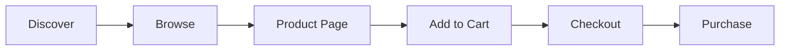

Understand how buyers interact with the marketplace and your storefront to optimize your product listings and increase sales.

## How buyers discover products

Buyers can find products through multiple paths:

1. **Marketplace homepage**: Browse featured and curated products
2. **Vendor storefronts**: Direct access via `[vendor-slug].shop.com`
3. **Category navigation**: Browse by category and subcategory
4. **Search and filters**: Find specific products using filters

## The marketplace homepage

When buyers visit the main marketplace, they see:

### Navigation elements
- **Navbar**: Access to categories, search, and account
- **Category menu**: Browse products by category
- **Search bar**: Search across all vendors

### Product discovery
- **"Curated for you" section**: Featured product listings
- **Category filters**: Filter by categories and subcategories
- **Tag filters**: Filter by product tags
- **Price filters**: Set minimum and maximum price ranges
- **Sort options**: Sort by price, date, or relevance

### Featured products

Products from all vendors appear on the marketplace homepage, giving your products exposure beyond your own storefront.

## Vendor storefront experience

Each vendor has a dedicated storefront at their unique subdomain.

### Accessing a storefront

Buyers can visit your storefront at:
```
[your-username].shop.com
```

### Storefront layout

Your storefront displays:

**Header section:**
- Your store name
- Your store logo/image (if uploaded)
- Navigation to your products

**Product listing:**
- All your published products
- Same filtering and sorting options as the marketplace
- "Curated for you" heading

**Filters (left sidebar):**
- Category filters
- Tag filters
- Price range slider

**Sort options:**
- Sort dropdown in the top right
- Options for organizing product display

<Note>
  Your storefront uses a narrower view optimized for browsing a single vendor's catalog.
</Note>

## Product browsing

### Product cards

In listing views, buyers see product cards with:

- Product image (or placeholder if no image)
- Product name
- Price formatted with currency symbol
- Quick "Add to cart" button

### Filtering products

Buyers can refine their search using:

**Category filters:**
- Select parent categories
- Drill down into subcategories
- Multiple category selection

**Tag filters:**
- Choose from all available tags
- Multi-select for combining tag filters

**Price filters:**
- Set minimum price
- Set maximum price
- Slider interface for easy adjustment

### Sorting products

Buyers can organize product listings:
- Newest first
- Price: Low to high
- Price: High to low
- Relevance (default)

## Product detail page

When buyers click on a product, they see a detailed view:

### Product information

**Hero image:**
- Large product image (3.9:1 aspect ratio)
- High-quality image display
- Border and background styling

**Main details:**
- Product name (large heading)
- Product description (or "No description provided" message)
- Price in a highlighted pink badge
- Vendor information with clickable link

**Purchase options:**
- Add to cart button (pink background)
- Remove from cart (if already added, white background)
- Share link button
- Refund policy information

**Trust indicators:**
- Money-back guarantee period (or "No refunds")
- Refund policy badge

### Vendor information

The product page prominently displays:

- Your store name
- Your store logo (if uploaded)
- Link to your full storefront

Buyers can click your store name/logo to browse more of your products.

## Shopping cart and checkout

### Adding to cart

When buyers add products to their cart:

1. Product is stored in local cart for the specific vendor
2. Button changes from "Add to cart" to "Remove from cart"
3. Cart icon updates to show item count
4. Toast notification confirms the action

<Info>
  The marketplace uses a multi-vendor cart system. Each vendor's products are tracked separately.
</Info>

### Cart management

Buyers can:

- Add multiple products from different vendors
- View cart contents
- Remove individual products
- See total price calculation
- Proceed to checkout

### Checkout experience

<Steps>
<Step title="Navigate to checkout">
  Buyer clicks the cart icon or checkout button.
</Step>

<Step title="Review cart items">
  The checkout page displays:
  
  **Left side (cart items):**
  - Product image
  - Product name
  - Product price
  - Vendor name and storefront link
  - Link to individual product page
  - Remove button for each item
  
  **Right side (checkout sidebar):**
  - Total price for all items
  - Checkout button
  - Order summary
</Step>

<Step title="Process payment">
  Buyer clicks the checkout button to proceed with payment through Stripe.
</Step>

<Step title="Order confirmation">
  After successful payment, buyer receives confirmation.
</Step>
</Steps>

### Checkout layout

The checkout page uses a responsive grid:

- **Desktop**: 4 columns for cart items, 3 columns for sidebar
- **Mobile**: Stacked layout for easy mobile checkout

### Empty cart state

If the cart is empty, buyers see:

- Inbox icon
- "No products found" message
- Dashed border box

## Category and subcategory navigation

Buyers can browse the marketplace hierarchy:

### Category pages

URL structure:
```
/[category-slug]
```

**Features:**
- Shows products in the selected category
- Breadcrumb navigation
- Same filtering and sorting options
- Subcategory quick links

### Subcategory pages

URL structure:
```
/[category-slug]/[subcategory-slug]
```

**Features:**
- Narrower product selection
- Breadcrumbs show full path
- All standard filters available

## Mobile experience

The marketplace is fully responsive:

### Mobile navigation
- Hamburger menu for categories
- Touch-friendly cart and account icons
- Swipeable product cards

### Mobile product pages
- Stacked layout for product details
- Full-width images
- Touch-optimized buttons

### Mobile checkout
- Simplified single-column layout
- Large touch targets
- Easy form input

## Search functionality

Buyers can search across the marketplace:

- Search by product name
- Search by description
- Results from all vendors
- Search combined with filters

## Trust and credibility elements

Buyers see several trust indicators:

### On product pages
- Refund policy clearly stated
- Vendor name and link to their storefront
- Professional product images
- Money-back guarantee information

### Throughout the marketplace
- Secure payment badges
- "Join over 1000+ creators" messaging
- Clean, professional design
- Fast loading times

## What buyers can't see

To protect vendor privacy, buyers don't see:

- Your Stripe Account ID
- Your admin dashboard
- Other vendors' sales data
- Backend product management
- Unpublished or draft products

## Optimizing for buyer experience

<AccordionGroup>
  <Accordion title="Use high-quality images">
    Buyers are more likely to click on and purchase products with:
    - Professional product photography
    - Clear, well-lit images
    - Appropriate image dimensions
    - Consistent image style across your catalog
  </Accordion>
  
  <Accordion title="Write compelling descriptions">
    Help buyers make informed decisions:
    - Describe key features and benefits
    - Include dimensions, materials, or specifications
    - Highlight what makes your product unique
    - Use clear, concise language
  </Accordion>
  
  <Accordion title="Choose appropriate categories">
    Make your products discoverable:
    - Select the most relevant category
    - Use subcategories for specificity
    - Consider how buyers browse
    - Stay consistent with marketplace categories
  </Accordion>
  
  <Accordion title="Add relevant tags">
    Improve filtering and discovery:
    - Use tags buyers would search for
    - Include style, use case, or feature tags
    - Don't over-tag
    - Keep tags consistent across similar products
  </Accordion>
  
  <Accordion title="Set competitive prices">
    Price products strategically:
    - Research similar products on the marketplace
    - Consider your refund policy when pricing
    - Display prices clearly (automatic formatting helps)
    - Update prices based on demand
  </Accordion>
  
  <Accordion title="Offer buyer-friendly refund policies">
    Build trust with fair policies:
    - Longer refund windows increase buyer confidence
    - Balance protection with your business needs
    - Be consistent across your product line
    - Honor your stated policies
  </Accordion>
</AccordionGroup>

## Understanding buyer behavior

### How buyers find your products

1. **Direct storefront visits**: Loyal customers or shared links
2. **Category browsing**: Exploring marketplace categories
3. **Search**: Looking for specific products
4. **Filtering**: Using tags and price filters

### Common buyer journey



**Discover**: Find products via marketplace or storefront
**Browse**: Filter and sort to narrow options
**Product Page**: View details and make decision
**Add to Cart**: Commit to potential purchase
**Checkout**: Review cart and proceed
**Purchase**: Complete payment

### Conversion optimization

Increase the percentage of browsers who become buyers:

- Clear product images reduce uncertainty
- Detailed descriptions answer questions
- Fair refund policies reduce risk
- Competitive pricing encourages purchases
- Professional storefront builds credibility

## Next steps

<CardGroup cols={2}>
  <Card title="Managing Products" icon="box" href="/guides/managing-products">
    Optimize your product listings
  </Card>
  <Card title="Vendor Dashboard" icon="gauge" href="/guides/vendor-dashboard">
    Access your dashboard to make updates
  </Card>
</CardGroup>